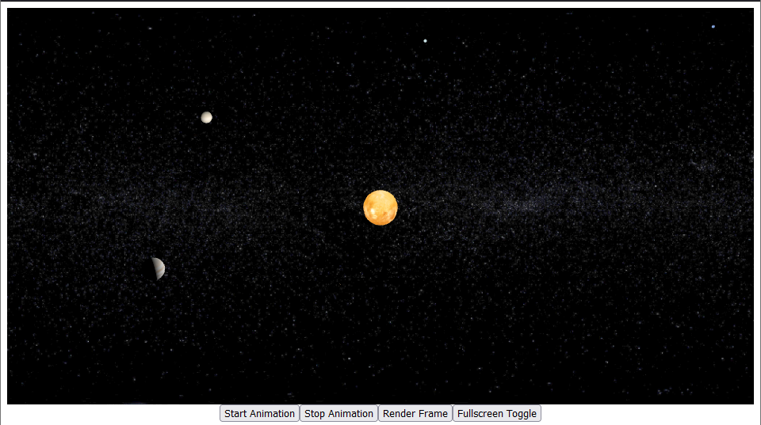

# About

Small project leveraging the 3js library in order to render 3D animations of a simplified Solar System. Used some of the code from [discoverthreejs](https://discoverthreejs.com/) as a starting point. Used some of the textures from [solarsystemscope](https://www.solarsystemscope.com/textures/). Using npm and webpack for dependency management and packaging.

Project can be viewed in GithubPages page:
[Live Demo](https://chrisblanks.github.io/3js-solar-system/)

Limitations:
- Scaling of astronomical objects is not accurate
- Rotational speed and orbit around the sun for astronomical objects
- No physics engine used for calculations
- Basic lighting used
- Only planets + sun are included
- Orbit not related to actual instances of time/history
- Astronomical bodies do not rotate based on their actual axes

# Building
To setup project after cloning, run `npm install` in the top level directory.

Execute `npm run build` to package source code into a bundle via webpack. Build artifacts
will appear in the `dist/` directory.

Use `npm run server` or `npx vite` to run server. Should be able to see build artifacts if `dist/` directory is added to url.
use `npx vite build` to build prod version and run in server

# Special Notes
`vendor/` directory contains only the necessary dependencies for runtime